<style>
  :root {
    --color-background: #fff;
    --color-foreground: #333;
    --color-highlight: #f96;
    --color-dimmed: #888;
  }
</style>

<!-- _class: - lead -->

# <!--fit--> PDR: 室内行人移动方位推算技术

*方盛俊 任圣杰 曹明隽*

PPT：https://marp-pdr.vercel.app/

[](https://github.com/nju-aml2022/Pedestrian-Dead-Reckoning-PDR)

## 目录

1. 前期思考
2. 总体思路
3. 数据预处理
4. 步伐检测
5. 方向预测
6. 性能测试

## 一、前期思考

经过分析，我们发现 PDR 算法的关键只有两点：

1. 如何预测出任给一个时间点的已走过的 **路程**。
1. 如何预测出任给一个时间点的对应 **前进方向**。

我们很容易猜想 **路程** 在 **理论上** 应该是通过 **加速计加速度** 二重积分得到的，方向应该是经过 **陀螺仪角速度** 一重积分得到的。

但是事实上理论和实践有着很大的差距，我们测量出来的 **加速度** 和 **角速度** 总是在不断的振荡，与真实数据存在非常大的误差。

### 因为存在下面的问题

1. 手机并不是固定在人的身上的，例如手机拿在手上时，就会随着手的活动不断摇摆振荡；
2. 手机自带的加速度计和陀螺仪就存在着一定的误差。

所以根据积分来计算出路程和方向的想法是不可行的，我们需要思考准确性和稳定性更强的方案。

### 这里我们发现：

1. 加速度的 **幅值的振荡频率** 和行人的 **步伐振荡频率** 强相关；
2. 磁力计的磁场强度与前进方向强相关（**磁场强度方向指向北方**）；
3. 我们拥有前 10% 的数据，可以从中学得很多有用的信息，比如 **每走一步的长度**，再比如 **初始的前进方向**。

根据这三个线索，我们制定了下面的 PDR 算法思路。


## 二、实现思路

总体思路为 **步伐检测** 和 **方向预测**。

我们需要在通过传感器得来的数据判断当前行人是否在行走，什么时侯迈出步子，行走的步幅大小为多少，前进的方向又是多少，便可以通过下面的公式来预测出行走的坐标点轨迹了。

$$
\begin{equation}
    \begin{cases}
        X_k = X_{k-1} + L_{k-1,k} \cdot \cos(\theta_{k-1, k}) \\
        Y_k = Y_{k-1} + L_{k-1,k} \cdot \sin(\theta_{k-1, k}) \\
    \end{cases}
\end{equation}
$$

其中 ($X$，$Y$) 为经纬度坐标点，$L_{k-1,k}$ 第$k-1$ 步的步幅，$\theta_{k-1, k}$ 为第 $k-1$ 步的方向。


## 三、数据预处理

为了更好地进行接下来代码的编写，我们进行了三种数据预处理：

1. 经纬度转换
2. 最近邻插值对齐数据
3. 抽象出 TestCase 类接口

通过数据预处理，我们就能够更为方便地加载、处理数据，以及最后的预测。

### 1. 经纬度转换

由于输入和输出的位置信息是以经纬度为准的，而经纬度作为位置信息有一些缺点：

1. 经纬度是绝对位置，不是相对位置，后续处理比较困难；
1. 经纬度的单位长度的实际物理长度过大，比如经纬度的一度可能就对应着几十或上百公里，而我们实际的行走范围可能不会超过一公里；
2. 经纬度是在球形地球的假设上进行计算的，难以直接转换成以米为单位，也难以转到平面坐标系。

###

针对上面问题，我们使用了一个公式：

$$
\begin{equation}
    \begin{cases}
        X_k = K \cdot (\mathrm{latitude}_k - \mathrm{latitude\_origin}) \\
        Y_k = K \cdot (\mathrm{longitude}_k - \mathrm{longitude\_origin}) \\
    \end{cases}
\end{equation}
$$

对经纬度进行转换，其中 $K = 10^{5}$，而 $\mathrm{latitude\_origin}$ 和 $\mathrm{longitude\_origin}$ 为我们选定的初始坐标点，这里我们选用了第 10% 行数据对应的经纬度为初始坐标点。

而 $K = 10^{5}$ 是为了将数据放大到和单位米相同的数量级，由于我们的运动范围较小，因此我们可以直接忽略球形地球假设，直接使用平面坐标系。

###

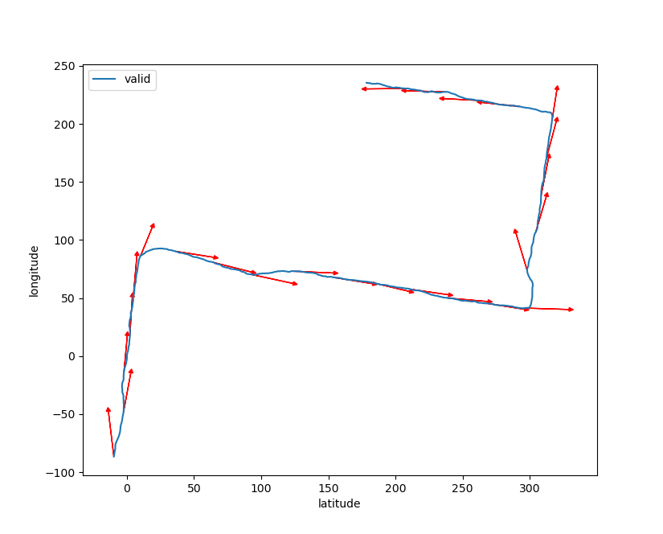

### 2. 最近邻插值对齐数据

我们的输入有五个文件（忽略气压计数据），分别为：

- `Accelerometer.csv`（加速度计数据，50 Hz）
- `Linear Accelerometer.csv`（线性加速度计数据，50 Hz）
- `Gyroscope.csv`（陀螺仪数据，50 Hz）
- `Magnetometer.csv`（磁力计数据，50 Hz）
- `Location_input.csv`（GPS 位置信息，1 Hz）

它们存在一个严重的问题：**由于传感器周期不一致，记录的数据并没有严格对齐**。

###

在这里，我们使用了 **最近邻插值** 的方法，以 `Location_input.csv` 的时间轴为基准，进行了最近邻插值，对数据进行了对齐处理。大致算法如下：

1. 将 `Location_input.csv` 的 1 Hz 的时间轴 `time_location` 线性扩充成 50 Hz 的时间轴 `time`, 例如 `time_locaiton = [1., 2.]` 的话，便会扩充成 `time = [1., 1.02, 1.04, ..., 1.98, 2., 2.02, ..., 2.98]`, 其中 `len(time) = 100`。
2. 将其他 50 Hz 的数据通过最近邻插值对齐到 `time` 时间轴上，最近邻插值即为每一个点匹配到最近的样本点。例如 `Accelerometer.csv` 的数据 `[[1.01, 1], [1.02, 2], [1.03, 3], [1.04, 4]]` 可能就会被最近邻插值为 `[[1.00, 1], [1.02, 2], [1.04, 4]]`。

### 3. TestCase 类接口

```python
# 通过文件路径加载一个 TestCase 
test_case = TestCase("test_case0")
# 可以对 TestCase 进行切片, 单位为秒
new_test_case = test_case.slice(100, 500)
# 1 Hz 的时间轴
print(test_case.time_location)
# 50 Hz 的时间轴
print(test_case.time)
# 加速度数据
print(test_case.a)
print(test_case.a_x)
print(test_case.a_y)
print(test_case.a_z)
# 加速度幅值
print(test_case.a_mag)
```


## 四、步伐检测

步伐检测主要分为两个部分：

1. **脚步提取**：行人何时向前迈了一步
2. **步幅估计**：向前迈的一步有多长

通过脚步提取和步伐检测，我们就能得到 **任意时刻行人走过的路程**。

### 1. 脚步提取

需要的数据有：

- **a_mag**（Accelerometer）：通过对加速度的数据求模得出一条震荡曲线；
- **GPS 位置中前 10% 的前进方向数据**（Location_input）：我们可以通过前 10% 的前进方向数据得到很多有用的数据，例如步长。

使用 `test_case0` 中的部分时间段内的加速度幅度作为处理示例，未经处理的数据如下：

###

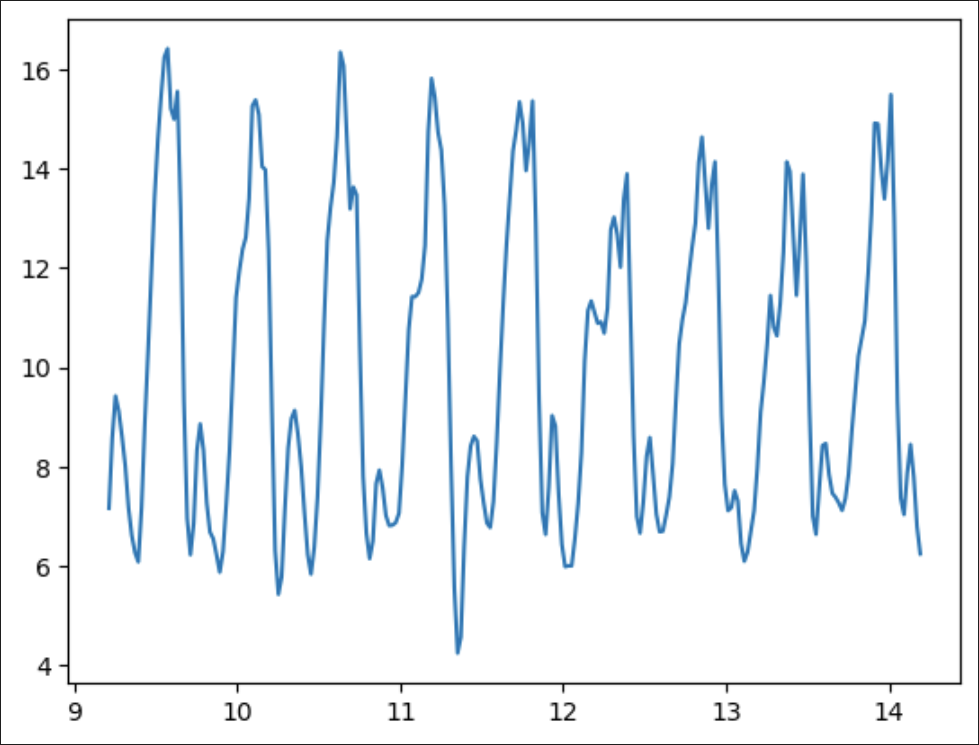

###

通过肉眼可以清晰的看出加速度的震荡具有规律性，较大峰值个数表示行人的可能步数。接着进行处理：

此时先用滤波器进行滤波，将波动变得更加光滑，消除小波峰:

```python
### 滤波器
def filter(range,data):
    filter = np.ones(range) / range
    return np.convolve(data, filter, mode="same")

new_test_case = test_case.slice(10, 15)
### 对 a_mag 进行滤波
filtered_a = filter(10,new_test_case.a_mag)
```

###

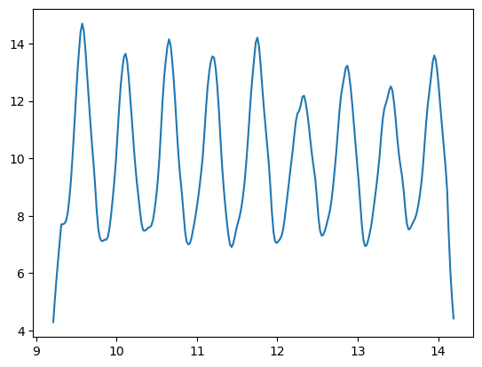

###

一般人的步频最大为 3 Hz ，设定 0.4 秒的间隔查找峰值，如果含有多个峰值，则其中含有假峰，选取波峰最大的那一个。

在选取好候选波峰后，其中依然可能含有假波峰，例如行人行走过程中突然停下来，停下来的期间不可避免的会有微小振动，而这些振动中的波峰也会被识别到。此时对所有候选波峰求平均，并保留大于 平均值*0.8 的部分。

波峰采集效果：

###

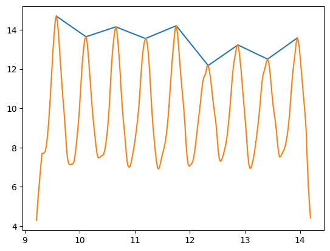

### 2. 步幅估计

我们通过前百分之十的数据，对步幅进行一个估计。

在预测前，我们发现并不知道行人每一步迈出的具体长度；而脚步波峰对应的时间 与 经纬度坐标的时间没有对齐。

$$
\begin{equation}
    \text{step\_length} = \frac{\text{distance}(d_i,d_j)}{\text{steps}(d_i,d_j)}
\end{equation}
$$

处理这个问题的方式是通过相距的两个点间的距离，除以这两坐标点间的脚步数，作为这两点间脚步的步幅。这里我们设定一个超参数 `distance_frac_step`，作为这两个坐标点间一共有包含多少坐标点。

### 构建线性回归

步幅本身因人而异，它是一个与行人有关的变量。然而对于同一行人，步幅长短主要与行人的步频 $\text{f}$ 与 每一步的跨度 $\sigma$ 有关（这里的跨度用加速度震荡方差表示）。下面用线性模型 [2] 表示：

$$
\begin{equation}
    \text{L} = A · \text{f} + B · σ + C
\end{equation}
$$

步频 $\text{f}$ 与加速度震荡方差 $\sigma$ 均通过上述处理获得。

除了线性回归外，我们还尝试了 `sklearn` 中其他的学习器，这里便不过多赘述。


## 五、方向预测

为了实现准确且稳定的前进方向预测功能，我们主要使用三类数据：

- **磁力计数据**（Magnetometer）：北半球磁场方向始终指向北偏下，因此磁力计数据是预测前进方向的核心；
- **加速度计中的重力加速度数据**（Accelerometer）：重力加速度数据始终朝下，是确定手机坐标轴朝向的核心；
- **GPS 位置中前 10% 的前进方向数据**（Location_input）：我们可以通过前 10% 的前进方向数据。

注意，我们并没有用到陀螺仪的数据，因为陀螺仪测出来的是角速度，很容易被手机的摇摆振荡的角速度变化干扰。

### 1. 低通滤波过滤手机自身振荡

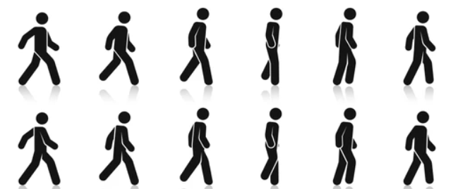

人的行走会引起振荡，导致了手机的摇摆。这也会引起手机坐标轴发生变化，进而导致测出来的磁力和加速度数据在 xyz 三个轴上不断地振荡变化。

###

为了消除这种振荡，我使用了一个截止频率相关参数 `Wn` 大致在 0.005 左右的 2 阶 **Butterworth 低通滤波器**，将磁力和加速度进行低通滤波，得到了更为平滑的磁力和加速度数据。

这里有一个很有趣的事实，由于加速度经过了低通滤波，几乎就等于被取了平均值，和重力无关的加速度被抵消，因此此时我们有：

**加速度 $a$ 的低通滤波几乎等于重力加速度 $g$**。

```python
b, a = signal.butter(2, 0.005, 'lowpass')
m_x = signal.filtfilt(b, a, tc.m_x)
m_y = signal.filtfilt(b, a, tc.m_y)
m_z = signal.filtfilt(b, a, tc.m_z)
```

###

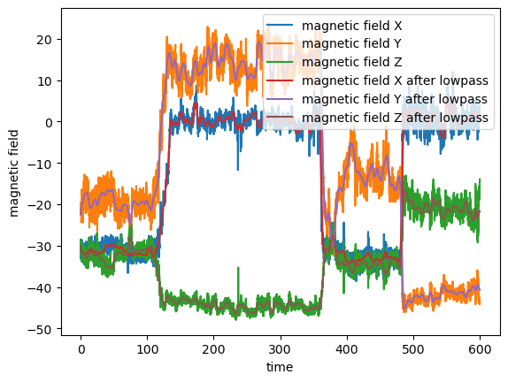

###

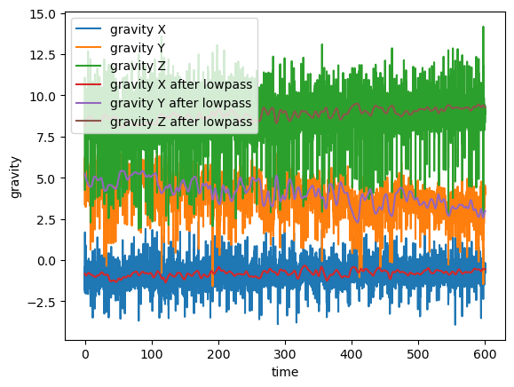

### 低通滤波的好处

这里有很关键的一点，这是作业文档中提到的一个假设，并且也是我们后续进行方向预测的核心假设：

**在实验过程中，手机大部分时间保持在同一个状态下（如一直拿在手上）**。

有了这个假设，我们就可以推出一个更强的结论：

**经过低通滤波后的数据，可以等同于，手机相对于人没有发生任何旋转、位移与振荡时（即完全固定），记录下来的数据。**

###

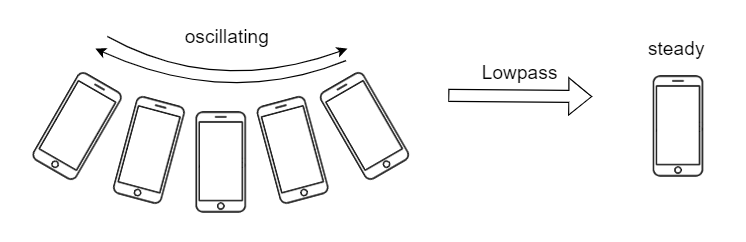

手机经过低通滤波后不再振荡，可以认为相对于人来说位置和方向是固定的。

借助这个结论，我们就可以使用空间解析几何的方法，通过磁力计等数据预测出当前的前进方向。

### 2. 空间解析几何预测偏转角度

首先我们有两个很重要的前提：

1. **磁力计测出来的数据，是在手机坐标系下的一系列向量，并且该向量方向总是指向北偏下；**
2. **重力加速度，是在手机坐标系下的一系列向量，并且该向量方向总是指向下。**

###

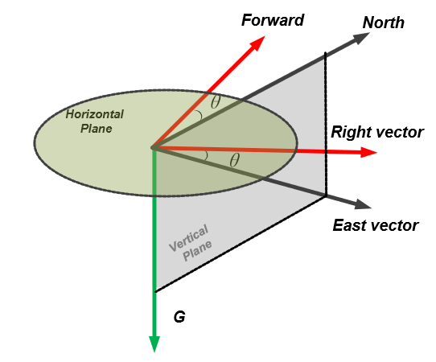

###

第一步，首先用重力加速度向量 $g$ 和磁力向量 $m$ 叉乘得到东向量 $e$。

$$
\begin{equation}
    e = g \times m
\end{equation}
$$

第二步，选出一个初始东向量，例如这里可以选取第 10% 个东向量作为初始东向量。

$$
\begin{equation}
    e_0 = e_{10\%}
\end{equation}
$$

第三步，通过东向量与初始东向量的点乘除以模获取东向量和初始东向量的夹角，并转成角度制。

$$
\begin{equation}
    \theta = \frac{180}{\pi} \cdot \arccos\frac{e \cdot e_0}{|e||e_0|}
\end{equation}
$$

###

注意，此时我们并不知道 $e$ 在 $e_0$ 的左侧还是右侧，所以我们缺少一个符号。 

第四步，通过东向量与初始东向量叉乘后，与重力加速度点乘，得到对应的正负符号。

$$
\begin{equation}
    \mathrm{signs} = - \operatorname{sign}((e \times e_0) \cdot g)
\end{equation}
$$

最后，我们就得到了前进方向与 $e_0$ 对应的初始方向 $\mathrm{direction\_0}$ 的偏转角度。

$$
\begin{equation}
    \mathrm{direction\_diff} = \mathrm{signs} \cdot \theta
\end{equation}
$$

###

最后的前进方向就是初始方向 $\mathrm{direction\_0}$ 加上偏转角度，即

$$
\begin{equation}
    \mathrm{direction} = \mathrm{signs} \cdot \theta + \mathrm{direction\_0}
\end{equation}
$$

还要记得最后取模 $360$，以便转换到区间 $[0, 360)$ 上。

### 3. 使用前 10% 的数据优化初始方向

选取初始东向量 $e_0$ 对应的初始方向 $\mathrm{direction\_0}$ 有两种可行的方案。

第一种是直接选用 $e_0$ 对应的第 10% 个方向数据作为初始方向 $\mathrm{direction\_0}$。这种办法的好处是计算快捷，而且不容易受到前面 $10%$ 的其他不准确数据的干扰。

第二种方法是，使用优化器，以及前 10% 的数据，最小化平均误差函数：

$$
\begin{equation}
    \operatorname{mean\_error}(x) = \operatorname{mean}(\operatorname{abs}(\mathrm{direction\_valid}, (\mathrm{signs} \cdot \theta + x)))
\end{equation}
$$

###

我们使用 `scipy` 的优化器，对应的优化代码为：

```python
# 平均误差
error_fn = lambda x: np.mean(
    direction_diff(direction_valid, (direction_offset + x)))
# 最小化误差获取最佳初始值
direction0 = scipy.optimize.minimize(error_fn, 0).x[0]
```

最后我们画出 `test_case0` 对应的图像，可以发现角度预测基本吻合。

###

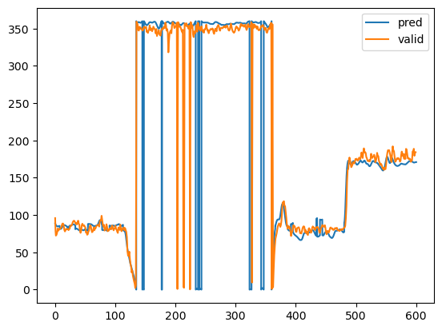


## 六、性能测试

在 test_case0 上的运行情况：

在 test_case0 上耗时 $2.844$ 秒完成推理，准确性指标为：

* 每个GPS 定位点下估计的位置和真实位置的直线距离的平均值 `dist_error` ：$30.46$ 米
* 方位角平均误差 `dir_error` ：$8.66\degree$ 
* 方位角平均误差小于 $15\degree$ 的比例 `dir_ratio` ： $92.6\%$

###

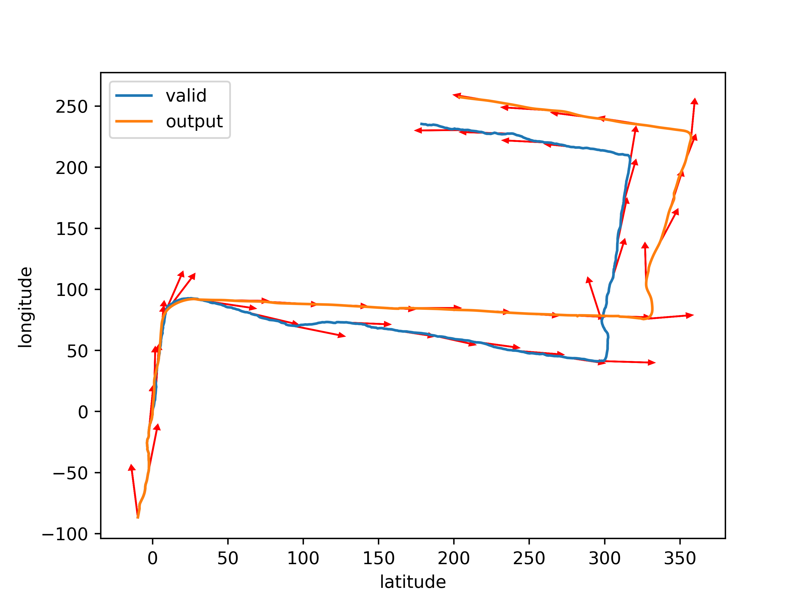

### 在测试数据集上的运行情况

在 10 个测试集上耗时 $28.30$ 秒完成推理，平均每个 $2.83$ 秒

由于没有真实 GPS 数据，无法获得准确性指标。

最后的结果保存于 `Result` 文件夹或 `TestSet` 文件夹中。

### 在收集数据集上的运行情况

在 51 个收集的行走数据集上耗时 $105$ 秒完成推理，平均每个 $2.06$ 秒，各数据集准确性指标的平均值为：

* 每个GPS 定位点下估计的位置和真实位置的直线距离的平均值 `dist_error` ：$109.08$ 米
* 方位角平均误差 `dir_error` ：$26.16\degree$ 
* 方位角平均误差小于 $15\degree$ 的比例 `dir_ratio` ： $50.2\%$
* 共 $15$ 个数据集上方位角平均误差小于 $15\degree$
* 共 $3$ 个数据集上方位角平均误差小于 $15\degree$ 的比例大于 $90\%$

###

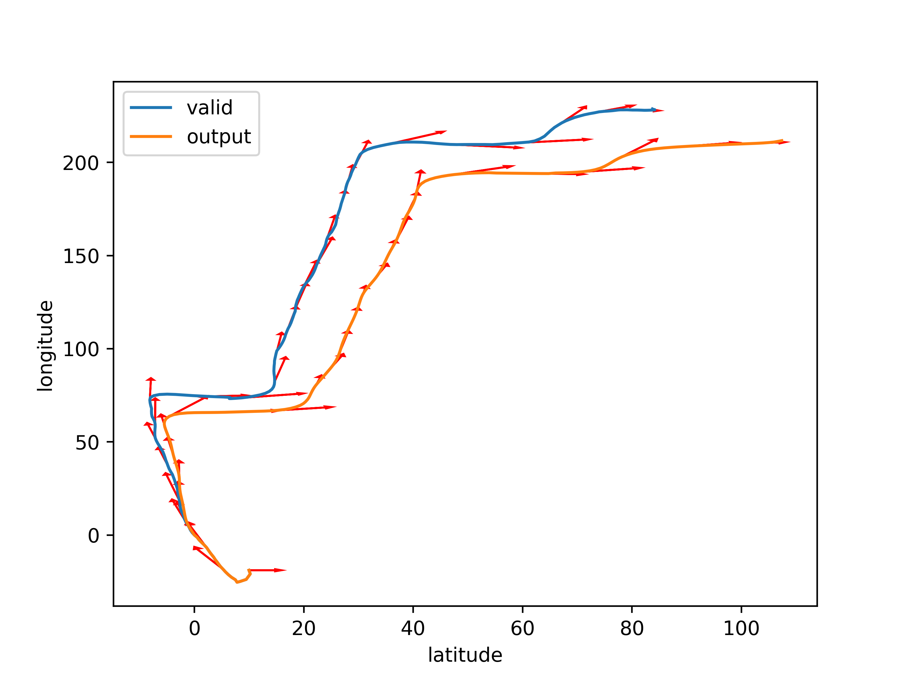

###

在 17 个收集的骑行或跑步数据集上耗时 $24$ 秒完成推理，平均每个 $1.41$ 秒，各数据集准确性指标的平均值为：

* 每个GPS 定位点下估计的位置和真实位置的直线距离的平均值 `dist_error` ：$113.52$ 米
* 方位角平均误差 `dir_error` ：$27.06\degree$ 
* 方位角平均误差小于 $15\degree$ 的比例 `dir_ratio` ： $58.3\%$
* 共 $9$ 个数据集上方位角平均误差小于 $15\degree$
* 共 $3$ 个数据集上方位角平均误差小于 $15\degree$ 的比例大于 $90\%$

###

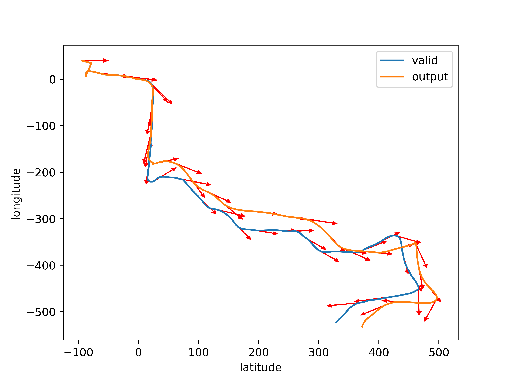


### 小组分工

1. 搜寻论文及资料：方盛俊、任圣杰、曹明隽
2. 数据录制：方盛俊、任圣杰、曹明隽
3. 数据预处理：方盛俊
4. 步伐预测：任圣杰
5. 角度预测：方盛俊、马潮增
6. 合并算法：任圣杰、方盛俊
7. 代码测试及参数调整：曹明隽
8. 实验报告：方盛俊、任圣杰、曹明隽


# 🎉
<!-- _class: - lead -->

#### Thanks!
